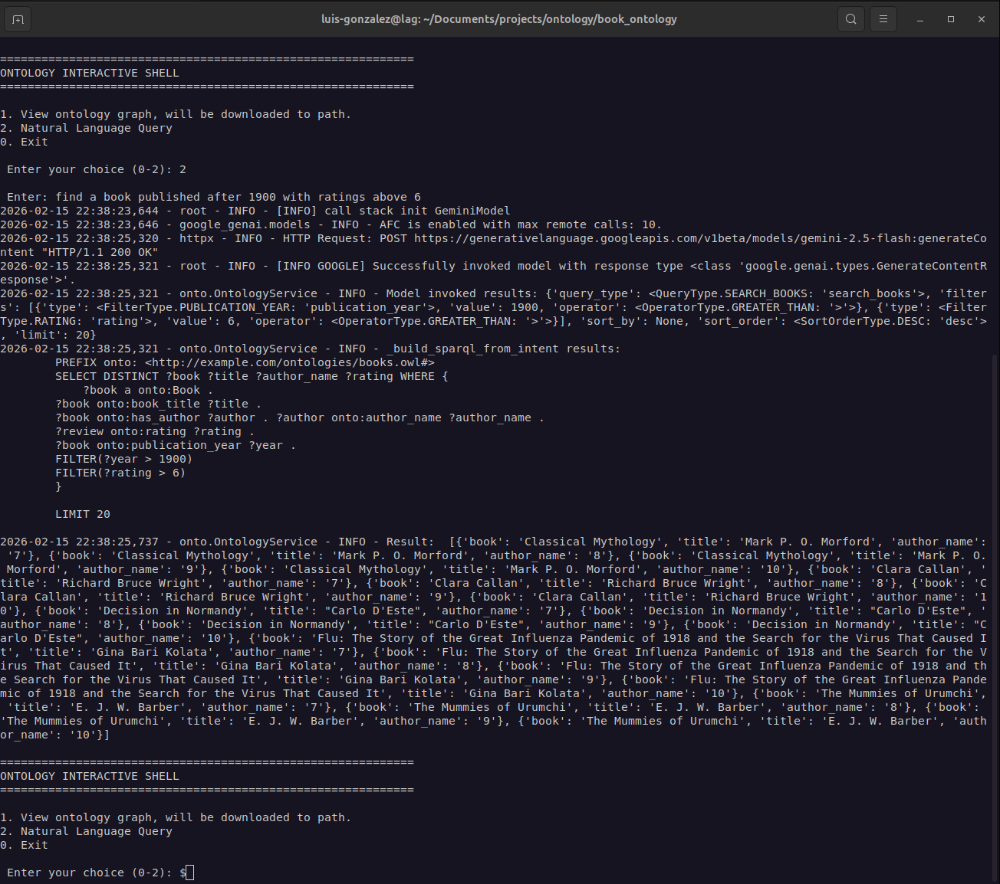
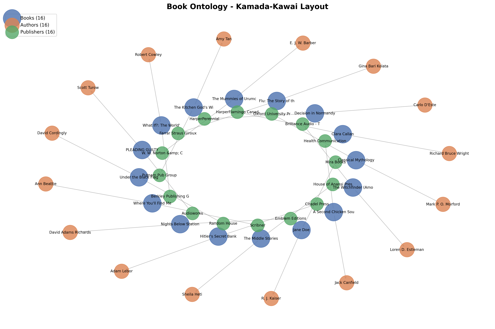
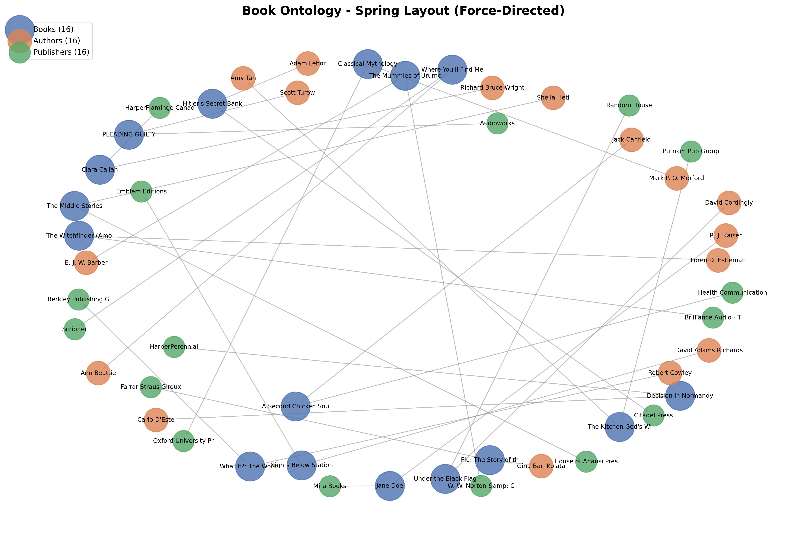

# Intro
A sophisticated book management system that combines OWL ontologies with Large Language Models (LLMs) to enable natural language queries over structured book data.
Short for book recommendation system using natural language.

# Features
Ontology-Based Data Model: Structured representation of books, authors, publishers, genres, and relationships

Natural Language Interface: Ask questions in plain English like "Find books with a rating above 6 with authors who have written at least 2 books"

Intelligent Query Processing: LLM-powered translation of natural language to structured queries

SPARQL Integration: Efficient querying using semantic web standards

Data Integration: Import from CSV/Excel datasets with automatic entity resolution

Type Safety: Pydantic validation for all query intents and responses

# Prerequisites

1. Python 3.8+
2. Google Gemini API key!
3. .env -> GEMINI_API_KEY="kjsbdf...."

# Getting Started
```bash

1. git clone this repo
2. create venv (Recommended) - python3 -v venv
3. activate venv - source venv/bin/activate
4. sh - pip install -r requirements.txt
5. Create .env file with API key
6. Note: Loading the entire ontology with the data provided, this encludes about 221k unique values, users 278K ... 
    Loading this might take a while.
    Alternatively, you can alter the dataframe using .head(NUM_OF_ROWS) to the following variable in __main__
    books, ratings, users. 
# Example: Limit to the first 1,000 rows
    books = books_df.head(1000)
    ratings = ratings_df.head(1000)
    users = users_df.head(1000)

6. Interactive shell 
```

# Architecture
```bash
┌─────────────────┐    ┌─────────────────┐    ┌─────────────────┐
│   Natural       │    │      LLM        │    │   Query         │
│   Language      │────▶   (Gemini)      │────▶   Intent        │
│   Query         │    │                 │    │   Parser        │
└─────────────────┘    └─────────────────┘    └─────────────────┘
                                                            │
                                                            ▼
┌─────────────────┐    ┌─────────────────┐    ┌─────────────────┐
│   Results       │    │     SPARQL      │    │   OWL           │
│   Formatter     │◀───│   Query         │◀───│   Ontology      │
│                 │    │   Generator     │    │   (OWLReady2)   │
└─────────────────┘    └─────────────────┘    └─────────────────┘
```

# A few examples of the ontology loaded. 

Interactive shell to view options available, create graphs with max_node amount or natural query.


50 nodes max, full dataset ontology.
Note the various reviews for books.


Full ontology, with 50 nodes


Sample size of about 50 nodes



# To do
1. Linking to the World (DBpedia/Wikidata)
    - Instead of just a name string
    - jk_rowling = self.onto.Author("author_jk_rowling")
    - jk_rowling.author_name = ["J.K. Rowling"]

    - Add a 'seeAlso' or 'sameAs' link to the global ID
    - jk_rowling.comment = ["https://dbpedia.org/resource/J._K._Rowling"]
    - ThenThe "Simple" Federated Query

